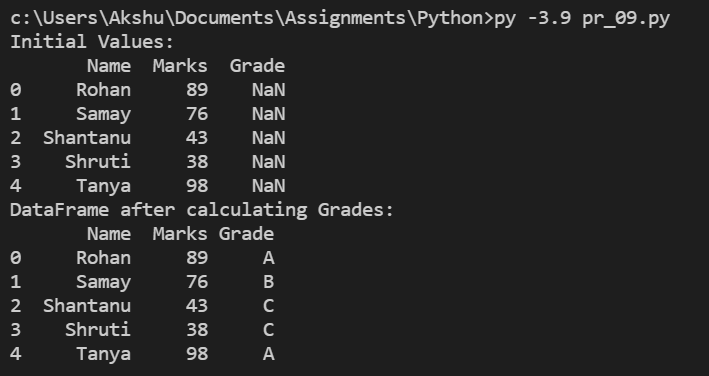
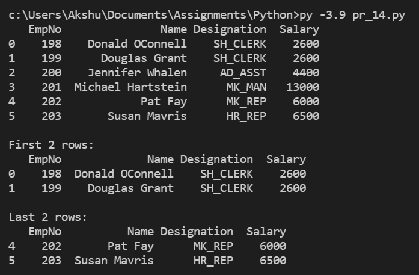
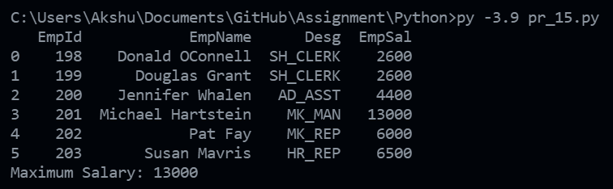
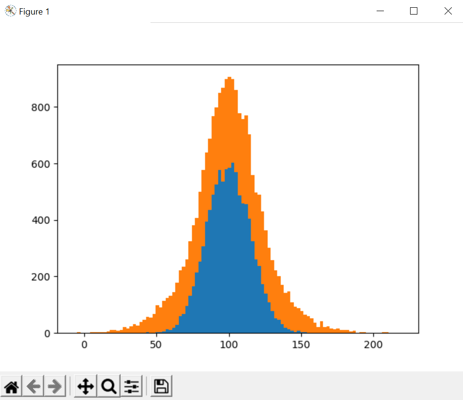

# Python Programs

<!-- 1 -->
## Project 1:
<font size=3>
Write python code to find out the biggest and smallest three items from the given Series.
The series area has been created like :-

```py
area = pd.Series([3659,858,9659,78965,34568, 12456, 6935, 25649, 85214, 9645,3695])
```
</font>

Code:
```py
import pandas as pd

area = pd.Series([3659, 858, 9659, 78965, 34568, 12456, 6935, 25649, 85214, 9645, 3695])

print(f"Biggest 3 Items:\n{area.sort_values().tail(3)}")
print(f"Smallest 3 Items:\n{area.sort_values().head(3)}")
```

Output:


<hr>
<br>


<!-- 2 -->
## Project 2:
<font size=3>
Write python code to find out the areas that are more than 50000 km^2.
The series area has been created like :-

```py
area = pd.Series([3659,858,9659,78965,34568, 12456, 6935, 25649, 85214, 9645,3695])
```
</font>

Code:
```py
import pandas as pd

area = pd.Series([3659, 858, 9659, 78965, 34568, 12456, 6935, 25649, 85214, 9645, 3695])

print(*[i for i in area if i > 50000], sep="\n")
```

Output:


<hr>
<br>


<!-- 3 -->
## Project 3:
<font size=3>
Write a Python program to create a Series object with 6 random integers and
having vowel characters as indexes.
</font>

Code:
```py
import pandas as pd
import numpy as np

vals = np.random.randint(0, 100, 6)
series = pd.Series(vals, index=["A", "B", "C", "D", "E", "F"])

print(series)
```

Output:


<hr>
<br>


<!-- 4 -->
## Project 4:
<font size=3>
Write a program to create a data series and then change the indexes of the Series object in any random order.
</font>

Code:
```py
import pandas as pd
import numpy as np

series = pd.Series(
    data=[1, 2, 3, 4, 5, 6, 7, 8], index=["A", "B", "C", "D", "E", "F", "G", "H"]
)
print(f"Data Series:\n{series}")

series_changed = series.reindex(index=["B", "G", "C", "F", "E", "A", "H", "D"])
print(f"Data Series after reindexing:\n{series_changed}")
```

Output:


<hr>
<br>


<!-- 5 -->
## Project 5:
<font size=3>
Create a series object marks, containing marks of 6 students. Write a Python program to sort the values of a
Series object marks in ascending order and descending order and store it into Series object ascMarks and
descMarks respectively.
</font>

Code:
```py
import pandas as pd

marks = pd.Series(
    [98, 49, 86, 78, 96, 59], ["Ahana", "Sarthak", "Rashi", "Muskan", "Manvi", "Kashvi"]
)
print(f"Marks:\n{marks}")

asc_marks = marks.sort_values(ascending=True)
print(f"Marks after sorting in Ascending order:\n{asc_marks}")

desc_marks = marks.sort_values(ascending=False)
print(f"Marks after sorting in Descending order:\n{desc_marks}")
```

Output:


<hr>
<br>


<!-- 6 -->
## Project 6:
<font size=3>
Write a Python program to create a Dataframe Score containing following data :–

|         |   Arnab |   Ramit |   Samridhi |   Riya |   Mallika |   Preeti |
|:--------|--------:|--------:|-----------:|-------:|----------:|---------:|
| Maths   |      90 |      92 |         89 |     81 |        94 |       89 |
| Science |      91 |      81 |         91 |     71 |        95 |       78 |
| Hindi   |      97 |      96 |         88 |     67 |        99 |       76 |
</font>

Code:
```py
import pandas as pd

data = {
    "Arnab": [90, 91, 97],
    "Ramit": [92, 81, 96],
    "Samridhi": [89, 91, 88],
    "Riya": [81, 71, 67],
    "Mallika": [94, 95, 99],
    "Preeti": [89, 78, 76],
}

score = pd.DataFrame(data, ["Maths", "Science", "Hindi"])
print(score)
```

Output:


<hr>
<br>


<!-- 7 -->
## Project 7:
<font size=3>

Write a Python program to add one Column and one Row in the DataFrame Score, given in [Project 6](./pr_06.py).
</font>

Code:
```py
import pandas as pd

data = {
    "Arnab": [90, 91, 97],
    "Ramit": [92, 81, 96],
    "Samridhi": [89, 91, 88],
    "Riya": [81, 71, 67],
    "Mallika": [94, 95, 99],
    "Preeti": [89, 78, 76],
}

score = pd.DataFrame(data, ["Maths", "Science", "Hindi"])
print(score)

score.at["English", :] = [89, 78, 64, 48, 58, 68]
score.at[:, "Priya"] = [44, 76, 68, 82]
print(score)
```

Output:


<hr>
<br>


<!-- 8 -->
## Project 8:
<font size=3>
A list stores three dictionaries each storing details (old price, new price, change). Write a Python program to create a DataFrame from it.
</font>

Code:
```py
import pandas as pd

data = [{"Old Price": 7800}, {"New Price": 8000}, {"Change": 200}]

df = pd.DataFrame(data)
print(df)
```

Output:


<hr>
<br>


<!-- 9 -->
## Project 9:
<font size=3>
Write a program to iterate over a DataFrame containing names and marks, which then calculate marks as per the criteria and then adds them to the grade column.

Marks >= 80 grade is A, Marks >= 60 grade is B, Marks < 60 grade is C
</font>

Code:
```py
import pandas as pd
import numpy as np

names = pd.Series(["Rohan", "Samay", "Shantanu", "Shruti", "Tanya"])
marks = pd.Series([89, 76, 43, 38, 98])
stu = {"Name": names, "Marks": marks}

dfl = pd.DataFrame(stu, columns=["Name", "Marks"])
dfl["Grade"] = np.nan

print(f"Initial Values:\n{dfl}")

lstmarks = []
for col, col_series in filter(lambda column: column[0] == "Marks", dfl.iteritems()):
    for row, mks in enumerate(col_series):
        if mks >= 80:
            lstmarks.append("A")
        elif 80 > mks >= 60:
            lstmarks.append("B")
        elif mks < 60:
            lstmarks.append("C")

dfl["Grade"] = lstmarks
print(f"DataFrame after calculating Grades:\n{dfl}")
```

Output:



<hr>
<br>


<!-- 10 -->
## Project 10:
<font size=3>
Create a Dataframe Forest `dFrameForest`

|     | State   |   GrossArea | DenseForestArea   |
|:---:|:--------|------------:|------------------:|
|  0  | Assam   |       78438 | 2797.00           |
|  1  | Delhi   |        1483 | 6.72              |
|  2  | Kerela  |       38852 | 1663.00           |

Write a Python Program to print only the State and DenseForestArea for all rows.
</font>

Code:
```py
import pandas as pd

data = {
    "State": ["Assam", "Delhi", "Kerela"],
    "GrossArea": [78438, 1483, 38852],
    "DenseForestArea": [2792.00, 6.72, 1663.00],
}

df = pd.DataFrame(data)
print(df.loc[0:2, ["State", "DenseForestArea"]])
```

Output:


<hr>
<br>


<!-- 11 -->
## Project 11:
<font size=3>
Create a DataFrame `ResultDF`, contains

|         |   Arnab |   Ramit |   Samridhi |   Riya |   Mallika |
|:--------|--------:|--------:|-----------:|-------:|----------:|
| Maths   |      90 |      92 |         89 |     81 |        94 |
| Science |      91 |      81 |         91 |     71 |        95 |
| Hindi   |      97 |      96 |         88 |     67 |        99 |
| English |      95 |      86 |         95 |     80 |        95 |

Write a Python Program to:
<ol>
    <li> delete column 'Ramit' and 'Mallika' </li>
    <li> Delete row 'Hindi', Show the ResultDF. </li>
</ol>
</font>

Code:
```py
import pandas as pd

data = {
    "Arnab": [90, 91, 97, 95],
    "Ramit": [92, 81, 96, 86],
    "Samridhi": [89, 91, 88, 95],
    "Riya": [81, 71, 67, 80],
    "Mallika": [94, 95, 99, 95],
}
result_df = pd.DataFrame(data, ["Maths", "Science", "Hindi", "English"])
print(result_df)

del result_df["Ramit"]
del result_df["Mallika"]
result_df.drop(["Hindi"])
print(result_df)
```

Output:


<hr>
<br>


<!-- 12 -->
## Project 12:
<font size=3>
Create a DataFrame `ResultDF`, contains

|         |   Arnab |   Ramit |   Samridhi |   Riya |   Mallika |
|:--------|--------:|--------:|-----------:|-------:|----------:|
| Maths   |      90 |      92 |         89 |     81 |        94 |
| Science |      91 |      81 |         91 |     71 |        95 |
| Hindi   |      97 |      96 |         88 |     67 |        99 |
| English |      95 |      86 |         95 |     80 |        95 |

Write a Python code to:
<ol>
    <li> change the Rows Label "Maths" to "Mathematics" and "Science" to "SSc" </li>
    <li> change the Column Label "Arnab" to "Aman", and "Riya" to "Shreya" </li>
    <li> Print the DataFrame ResultDF </li>
</ol>
</font>

Code:
```py
import pandas as pd

data = {
    "Arnab": [90, 91, 97, 95],
    "Ramit": [92, 81, 96, 86],
    "Samridhi": [89, 91, 88, 95],
    "Riya": [81, 71, 67, 80],
    "Mallika": [94, 95, 99, 95],
}
result_df = pd.DataFrame(data, ["Maths", "Science", "Hindi", "English"])
print(result_df)

result_df.rename(index={"Maths": "Mathematics", "Science": "SSc"}, inplace=True)
result_df.rename(columns={"Arnab": "Aman", "Riya": "Shreya"}, inplace=True)
print(result_df)
```

Output:


<hr>
<br>


<!-- 13 -->
## Project 13:
<font size=3>
Create the following DataFrame Sales containing year wise sales figures for five sales persons in INR. Use the years as column labels, and sales person names as row labels.

|         |   2014 |   2015 |   2016 |   2017 |
|:--------|-------:|-------:|-------:|-------:|
| Madhu   |  100.5 |  12000 |  20000 |  50000 |
| Kusum   |  150.8 |  18000 |  50000 |  60000 |
| Kinshuk |  200.9 |  22000 |  70000 |  70000 |
| Ankit   |  30000 |  30000 | 100000 |  80000 |
| Shruti  |  40000 |  45000 | 125000 |  90000 |

Write a Python Program to do the following:
<ol>
    <li> Display the row labels of Sales. </li>
    <li> Display the column labels of Sales. </li>
    <li> Display the data types of each column of Sales. </li>
    <li> Display the dimensions, shape, size and value of Sales. </li>
    <li> Display the last two rows of Sales. </li>
    <li> Display the first two columns of Sales. </li>
    <li> Check if Sales DataFrame is empty or it contains data. </li>
</ol>
</font>

Code:
```py
import pandas as pd

data = {
    2014: [100.5, 150.8, 200.9, 30000, 40000],
    2015: [12000, 18000, 22000, 30000, 45000],
    2016: [20000, 50000, 70000, 100000, 125000],
    2017: [50000, 60000, 70000, 80000, 90000],
}

sales = pd.DataFrame(data, index=["Madhu", "Kusum", "Kinshuk", "Ankit", "Shruti"])
print(sales)

# a:
print(f"Row Labels of Sales:\n{sales.index}", end="\n\n")

# b:
print(f"Column Labels of Sales:\n{sales.columns}", end="\n\n")

# c:
print(f"DTypes for each column:\n{sales.dtypes}", end="\n\n")

# d:
print(f"Shape: {sales.shape}\nSize: {sales.size}\nValues:\n{sales.values}", end="\n\n")

# e:
print(f"Last 2 rows of Sales:\n{sales.tail(2)}", end="\n\n")

# f:
print(f"First 2 columns of Sales:\n{sales.iloc[:, :2]}", end="\n\n")

# g:
print(f"Is Sales empty?: {sales.empty}", end="\n\n")
```

Output:


<hr>
<br>


<!-- 14 -->
## Project 14:
<font size=3>
Write a program to read from a CSV file Employee.csv and create a DataFrame from it, and
<ol>
    <li> Print the DataFrame </li>
    <li> Print the first 2 rows </li>
    <li> Print the last 2 records. </li>
</ol>

Employee CSV files contains (Empno, Name, Desgination, Salary) of 6 employees
</font>

Code:
```py
import pandas as pd

df = pd.read_csv("./employees.csv")
print(df)

print(f"\nFirst 2 rows:\n{df.head(2)}")
print(f"\nLast 2 rows:\n{df.tail(2)}")
```

Output:



<hr>
<br>


<!-- 15 -->
## Project 15:
<font size=3>

Write a program to read from a CSV file [employees.csv](./employees.csv) and create a DataFrame from it but dataframe should not use file’s column header rather should use one column heading EmpId, EmpName, Desg, EmpSal.
Also print the maximum salary given to an employee.

Employee CSV files contains (Empno, Name, Desgination, Salary) of 6 employees.
</font>

Code:
```py
import pandas as pd

df = pd.read_csv("./employees.csv", index_col="EmpNo")
print(df)
print(f"Maximum Salary: {df.Salary.max()}")
```

Output:



<hr>
<br>


<!-- 16 -->
## Project 16:
<font size=3>
Write a program to plot a bar chart from the scores of four students in five different subjects. Make sure that bars are separately visible.
</font>

Code:
```py
import matplotlib.pyplot as plt

sub = ["English", "History", "IP", "Pscyhology", "Political Science"]
samaira = [89, 87, 96, 94, 91]
aryan = [67, 89, 56, 45, 67]
ashish = [56, 45, 52, 34, 57]
paras = [46, 32, 37, 48, 42]

plt.bar(sub, samaira, label="Samaira")
plt.bar(sub, aryan, label="Aryan")
plt.bar(sub, ashish, label="Ashish")
plt.bar(sub, paras, label="Paras")
plt.legend(loc=2)
plt.xlabel("Subjects")
plt.ylabel("Marks")
plt.show()
```

Output:


<hr>
<br>


<!-- 17 -->
## Project 17:
<font size=3>
Write a program to plot a horizontal bar chart from the height of 6 students in your class.
</font>

Code:
```py
import matplotlib.pyplot as plt

y = (168, 175, 164, 158, 150, 159)
x = (1, 2, 3, 4, 5, 6)
plt.barh(x, y)
plt.show()
```

Output:


<hr>
<br>


<!-- 18 -->
## Project 18:
<font size=3>
Write a program to plot a line chart to display the changing weekly onion prices for four weeks.
</font>

Code:
```py
import matplotlib.pyplot as plt

week = [1, 2, 3, 4]
prices = [48, 60, 45, 85]

plt.plot(week, prices)
plt.xlabel("Week")
plt.ylabel("Onion Prices")
plt.show()
```

Output:


<hr>
<br>


<!-- 19 -->
## Project 19:
<font size=3>
First 10 terms of a Fibonacci series are stored in a list namely

```py
fib = [0,1,1,2,3,5,8,13,21,34]
```

```py
sqre = np.sqrt(fib)
```

Write a program to plot Fibonacci terms and their square root with two separate line. (with different types of markers)
</font>

Code:
```py
import matplotlib.pyplot as plt
import numpy as np

fib = [0, 1, 1, 2, 3, 5, 8, 13, 21, 34]
sqfib = np.sqrt(fib)

plt.plot(range(1, 11), fib, linestyle="solid")
plt.plot(range(1, 11), sqfib, linestyle="dashed")
plt.show()
```

Output:


<hr>
<br>


<!-- 20 -->
## Project 20:
<font size=3>
Prof. Singh is doing some research in the field of Environment. For some plotting purposes, he has generated some data as:

```py
mu = 100
sigma = 15
x = mu + sigma * numpy.random.randn(10000)
y = mu + 30 * numpy.random.randn(10000)
```

Write a program to plot this data on a bar-stacked horizontal histogram with both x and y.
</font>

Code:
```py
import matplotlib.pyplot as plt
import numpy as np

mu = 100
sigma = 15
x = mu + sigma * np.random.randn(10000)
y = mu + 30 * np.random.randn(10000)

plt.hist([x, y], bins=100, histtype="barstacked")
plt.show()
```

Output:




<hr>
<br>