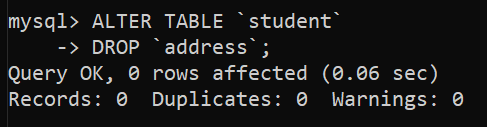

# Project 21: SQL Queries

> [SQL](./pr_21.sql) File for all the commands.

<ol>
<li>
Write a SQL command to create a Database named 'school'.

```sql
CREATE DATABASE `school`;
```


</li>

<hr>
<br>

<li>
Create a student table with the student id, name, and marks as attributes where the student id is the primary key.

```sql
CREATE TABLE `student` (
    `student_id` INT       PRIMARY KEY,
    `name`       CHAR(30),
    `marks`      INT
);
```


</li>

<hr>
<br>

<li>
Add columns ‘Mobile’ and ‘Sex’ in the table student.

```sql
ALTER TABLE `student`
ADD (
    `mobile` BIGINT,
    `sex`    CHAR(10)
);
```

</li>

<hr>
<br>

<li>
Add column ‘Address’ in the table student.

```sql
ALTER TABLE `student`
ADD (`address` CHAR(30));
```

</li>

<hr>
<br>

<li>
Change the name of column ‘Sex’ to ‘Gender’

```sql
ALTER TABLE `student`
CHANGE `sex` `gender` CHAR(10);
```

</li>

<hr>
<br>

<li>
Delete a column ‘Address’ from table Student.

```sql
ALTER TABLE `student`
DROP `address`;
```

</li>

<hr>
<br>

<li>
Insert the details of 10 new students in the above table.

```sql
INSERT INTO `student` (`student_id`, `name`, `marks`, `mobile`, `gender`)
VALUES (1004, 'Reenu', 87, 9910281550, 'FEMALE'),
       (2019, 'Sanya', 94, 7011195462, 'FEMALE'),
       (3897, 'Sarthak', 76, 9876567891, 'MALE'),
       (7652, 'Zoya', 91, 9876453456, 'FEMALE'),
       (2341, 'Vansh', 87, 9876655278, 'MALE'),
       (3456, 'Sarthak', 67, 8798765678, 'MALE'),
       (7856, 'Astha', 89, 9876789678, 'FEMALE'),
       (1267, 'Anshika', 97, 8700522033, 'FEMALE'),
       (3045, 'Deepanshu', 54, 8700999884, 'MALE'),
       (3452, 'Siya', 86, 9988775645, 'FEMALE');
```

</li>

<hr>
<br>

<li>
Use the select command to get the details of the students with marks more than 80.

```sql
SELECT *
FROM `student`
WHERE `marks` > 80;
```

</li>

<hr>
<br>

<li>
Change the mobile number of any one student.

```sql
UPDATE `student`
SET `mobile` = 9988765678
WHERE `student_id` = 3452;
```

</li>

<hr>
<br>

<li>
Display the details of those students which name start with ‘A’

```sql
SELECT *
FROM `student`
WHERE `name` LIKE 'A%';
```

</li>

<hr>
<br>

<li>
Write output :SELECT LENGTH(NAME), SUBSTR(NAME, 3,3) FROM STUDENT;

```sql
SELECT LENGTH(`name`),
       SUBSTR(`name`, 3, 3)
FROM `student`;
```

</li>

<hr>
<br>

<li>
Write output : SELECT COUNT (DISTINCT GENDER) FROM STUDENT;

```sql
SELECT COUNT(DISTINCT `gender`)
FROM `student`;
```

</li>

<hr>
<br>

<li>
Display a report like ‘Aditya is scored 20 out of 30” for each student. Where Aditya is the name of student and 20 is the marks of Aditya.

```sql
SELECT CONCAT(`name`, ' has scored ', `marks`, ' out of 100') AS `REPORT`
FROM `student`;
```

</li>

<hr>
<br>

<li>
Find the min, max, sum, and average of the marks in a student marks table.

```sql
SELECT MAX(`marks`) AS `MAXIMUM MARKS`,
       MIN(`marks`) AS `MINIMUM MARKS`,
       SUM(`marks`) AS `TOTAL MARKS`,
       AVG(`marks`) AS `AVERAGE MARKS`
FROM `student`;
```

</li>

<hr>
<br>

<li>
Display the Gender, Minimum marks and Maximum Marks Gender wise.

```sql
SELECT `gender`,
       MIN(`marks`) AS `MINIMUM MARKS`,
       MAX(`marks`) AS `MAXIMUM MARKS`
FROM `student`
GROUP BY `gender`;
```

</li>

<hr>
<br>

<li>
Find the total number of students from student table gender wise using group by.

```sql
SELECT COUNT(`name`),
       `gender`
FROM student
GROUP BY `gender`;
```

</li>

<hr>
<br>

<li>
Write a SQL query to order the (student ID, marks) table in descending order of the marks.

```sql
SELECT `student_id`,
       `marks`
FROM `student`
ORDER BY `marks` DESC;
```

</li>

<hr>
<br>

<li>
Delete the details of a student in the above table.

```sql
DELETE FROM `student`
WHERE `student_id` = 1004;
```

</li>

<hr>
<br>

<li>
Delete the table Student.

```sql
DROP TABLE `student`;
```

</li>

<hr>
<br>

<li>
Delete the Database School.

```sql
DROP DATABASE `school`;
```

</li>
</ol>